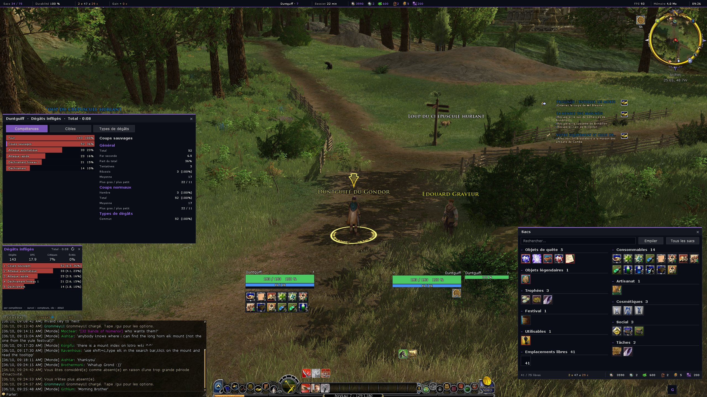
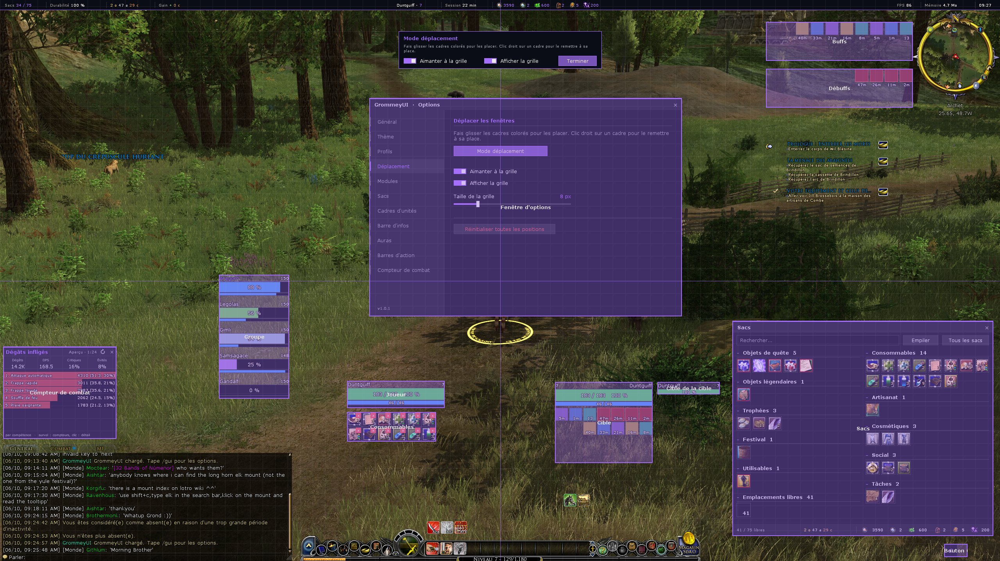
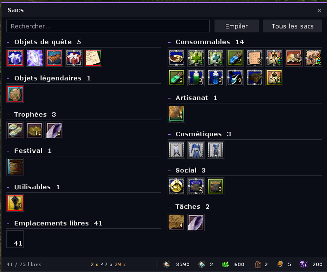
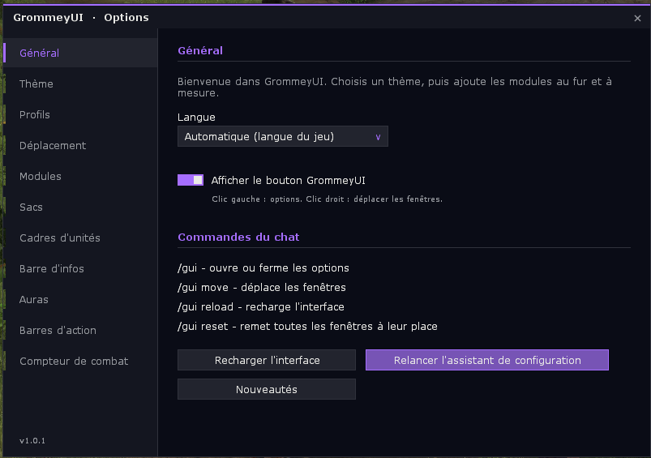

# GrommeyUI

A clean, modern all-in-one interface for **The Lord of the Rings Online**: flat, opaque frames, one accent colour, and everything can be set and moved where you want.

*Une interface moderne et épurée, tout-en-un, pour LOTRO. [Version française plus bas](#français).*

| | |
|:---:|:---:|
|  |  |
| In game: combat meter and its detail window, bags | Move mode |
|  |  |
| Bags | Options |

## Features

- **Bags**: all your bags in one window, sorted by category, with search, new items and currencies.
- **Unit frames**: player, target and party frames replacing the game ones, with buffs and debuffs.
- **Info bar**: money, currencies, bag slots, durability, FPS and time along the edge of the screen.
- **Auras**: your buffs and debuffs in two areas of their own, next to the minimap, with detailed tooltips.
- **Action bars**: extra bars for skills, items and commands, and a consumables bar that fills itself from your backpack.
- **Combat meter**: replaces Combat Analysis for your character. Damage done and taken, enemies, healing and power, fight by fight, with key figures, bars by skill or target, a summary and a detail window with every counter (critical hits, average, avoidance, damage types). Fights are kept between reloads.
- **Themes**: six accent colours, three backgrounds, three fonts and a text size.
- **Profiles**: shared between characters, with export / import as a text code.
- **Move mode**: drag every frame where you want, with a grid and snapping.
- **Setup assistant** on first launch, in **English, French and German**.

## Installation

1. Download **GrommeyUI-x.y.z.zip** from the [latest release](https://github.com/JeromeM/GrommeyUI/releases/latest) (or from LoTROInterface).
2. Unzip it into `Documents\The Lord of the Rings Online\Plugins\`: it holds the `GrommeyUI` folder, nothing to rename.
3. In game, load **GrommeyUI** from the plugin manager, or type `/plugins load GrommeyUI`.

Do not load `~GrommeyUIReloader` yourself: GrommeyUI uses it to reload itself.

## Commands

| Command | |
|---|---|
| `/gui` | open or close the options |
| `/gui move` | move the frames |
| `/gui reload` | reload the interface |
| `/gui reset` | put every frame back in place |
| `/gui meter` | show or hide the combat meter (`/gui meter reset` clears the fights) |

## Translations

Texts are written in English in the code and translated in `Locales/fr.lua` and `Locales/de.lua`.
`python3 tools/check_translations.py` lists the missing and unused translations.

## License

[MIT](LICENSE)

---

## Français

Une interface moderne et épurée pour **Le Seigneur des Anneaux Online** : fenêtres plates et opaques, une couleur de thème, et tout se règle et se place où on veut.

**Contenu** : sacs regroupés et triés par catégorie, cadres joueur / cible / groupe, barre d'infos, auras près de la minimap, barres d'action (dont une barre de consommables automatique), compteur de combat pour remplacer Combat Analysis (dégâts, soins, dégâts reçus, détail par compétence), thèmes, profils partageables par code, mode déplacement et assistant de configuration. En anglais, français et allemand.

**Installation** : télécharger **GrommeyUI-x.y.z.zip** dans la [dernière version](https://github.com/JeromeM/GrommeyUI/releases/latest) (ou sur LoTROInterface), le décompresser dans `Documents\The Lord of the Rings Online\Plugins\` (il contient le dossier `GrommeyUI`, rien à renommer), puis charger **GrommeyUI** dans le gestionnaire de plugins du jeu (ou `/plugins load GrommeyUI`). Ne pas charger `~GrommeyUIReloader` à la main.

**Commandes** : `/gui` (options), `/gui move` (déplacer), `/gui reload` (recharger), `/gui reset` (tout remettre en place), `/gui meter` (afficher ou masquer le compteur de combat).
