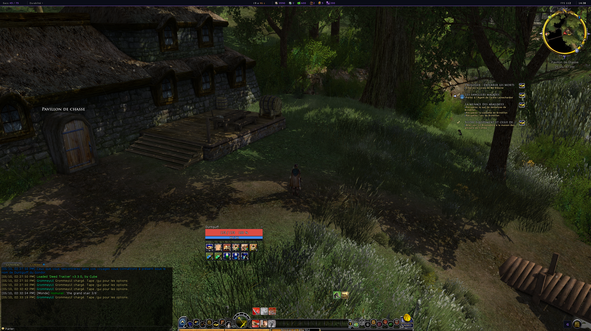
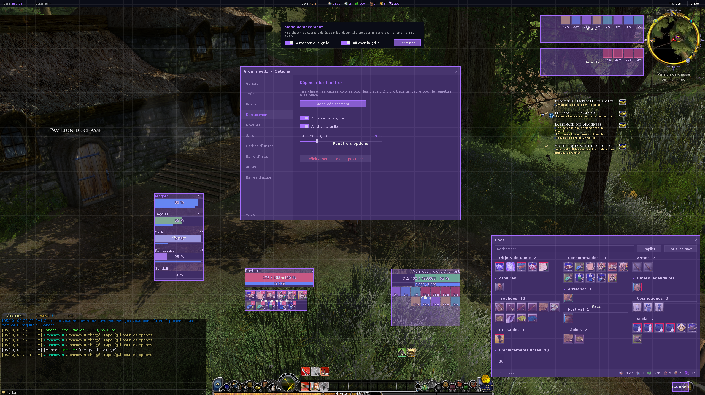
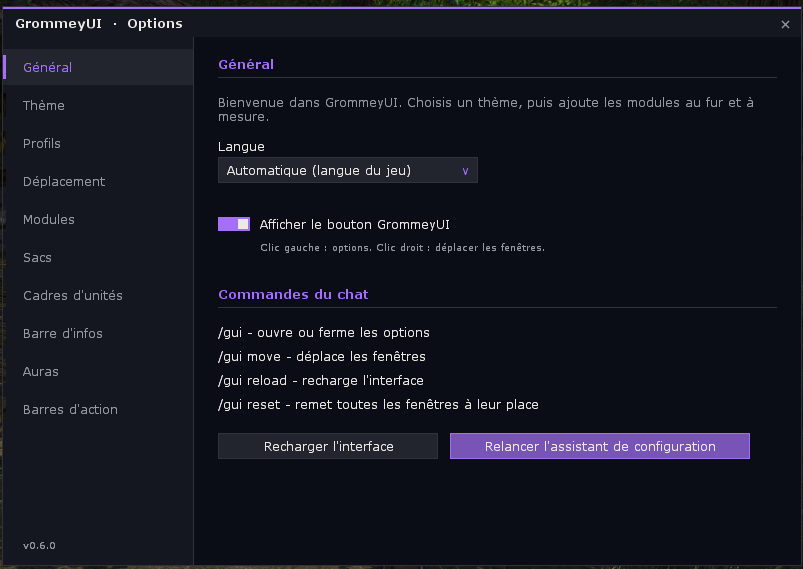
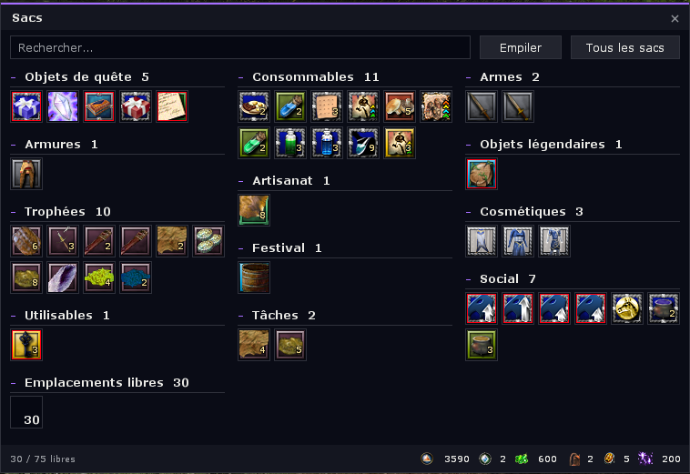

# GrommeyUI

A clean, modern all-in-one interface for **The Lord of the Rings Online**: flat, opaque frames, one accent colour, and everything can be set and moved where you want.

*Une interface moderne et épurée, tout-en-un, pour LOTRO. [Version française plus bas](#français).*

| | |
|:---:|:---:|
|  |  |
| In game | Move mode |
|  |  |
| Options | Bags |

## Features

- **Bags**: all your bags in one window, sorted by category, with search, new items and currencies.
- **Unit frames**: player, target and party frames replacing the game ones, with buffs and debuffs.
- **Info bar**: money, currencies, bag slots, durability, FPS and time along the edge of the screen.
- **Auras**: your buffs and debuffs in two areas of their own, next to the minimap, with detailed tooltips.
- **Action bars**: extra bars for skills, items and commands, and a consumables bar that fills itself from your backpack.
- **Themes**: six accent colours, three backgrounds, three fonts and a text size.
- **Profiles**: shared between characters, with export / import as a text code.
- **Move mode**: drag every frame where you want, with a grid and snapping.
- **Setup assistant** on first launch, in **English, French and German**.

## Installation

1. Download the code (green **Code** button, then **Download ZIP**) and unzip it.
2. Rename the folder to `GrommeyUI` and put it in `Documents\The Lord of the Rings Online\Plugins\`.
3. In game, load **GrommeyUI** from the plugin manager, or type `/plugins load GrommeyUI`.

Do not load `~GrommeyUIReloader` yourself: GrommeyUI uses it to reload itself.

## Commands

| Command | |
|---|---|
| `/gui` | open or close the options |
| `/gui move` | move the frames |
| `/gui reload` | reload the interface |
| `/gui reset` | put every frame back in place |

## Translations

Texts are written in English in the code and translated in `Locales/fr.lua` and `Locales/de.lua`.
`python3 tools/check_translations.py` lists the missing and unused translations.

---

## Français

Une interface moderne et épurée pour **Le Seigneur des Anneaux Online** : fenêtres plates et opaques, une couleur de thème, et tout se règle et se place où on veut.

**Contenu** : sacs regroupés et triés par catégorie, cadres joueur / cible / groupe, barre d'infos, auras près de la minimap, barres d'action (dont une barre de consommables automatique), thèmes, profils partageables par code, mode déplacement et assistant de configuration. En anglais, français et allemand.

**Installation** : télécharger le code (**Code** › **Download ZIP**), renommer le dossier en `GrommeyUI`, le placer dans `Documents\The Lord of the Rings Online\Plugins\`, puis charger **GrommeyUI** dans le gestionnaire de plugins du jeu (ou `/plugins load GrommeyUI`). Ne pas charger `~GrommeyUIReloader` à la main.

**Commandes** : `/gui` (options), `/gui move` (déplacer), `/gui reload` (recharger), `/gui reset` (tout remettre en place).
